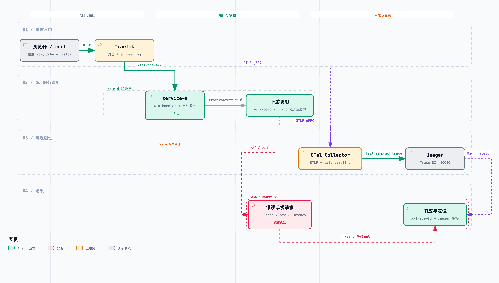
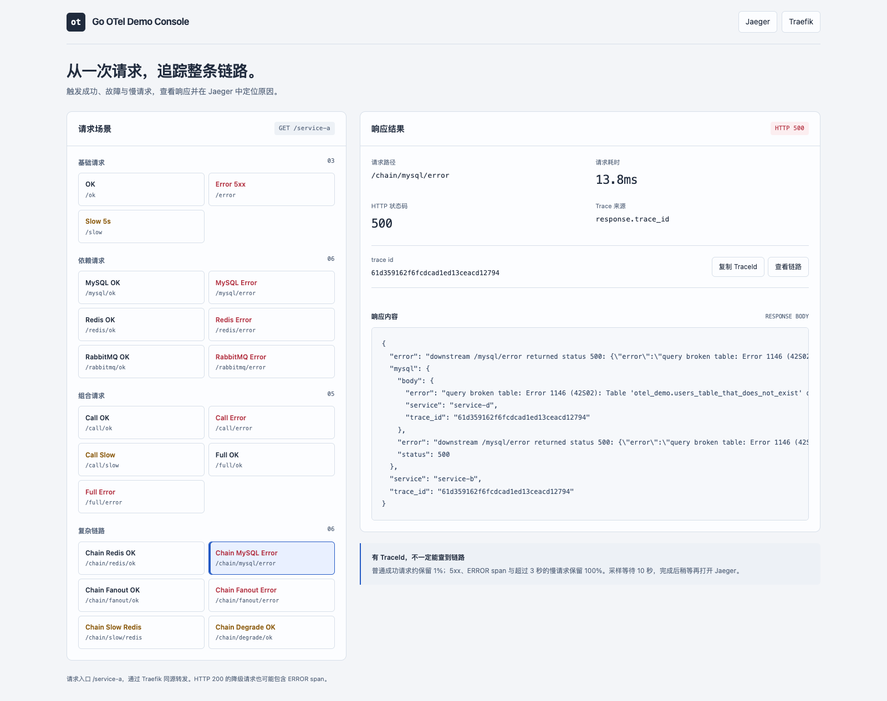

# Go OpenTelemetry Demo

用四个 Go 服务练习接入 OpenTelemetry：从浏览器发起请求，让 TraceContext 穿过 Traefik、多个 Gin 服务和 MySQL/Redis 调用，经 OTel Collector 采样后在 Jaeger 查看完整链路。项目还提供一个操作台，用来制造错误或慢请求，再把 TraceId 交给 AI 定位问题。



[打开可交互流程图](docs/diagrams/workflow.html) · [查看系统架构图](docs/diagrams/architecture.html)

## 这份 Demo 展示什么

- **Go 如何产生 span**：四个服务的 Dockerfile 使用 `otel go build` 编译，借助 LoongSuite Go Agent 为 Gin、HTTP 客户端、GORM/MySQL 等调用注入埋点；Compose 中的 `OTEL_*` 环境变量配置导出地址、采样器和传播格式。业务代码不手动初始化 TracerProvider。
- **一条 trace 如何跨服务**：请求进入 Traefik 后到 `service-a`；复杂场景继续调用 `service-b`，再到 `service-c`（Redis）或 `service-d`（MySQL）。HTTP 调用传播 W3C TraceContext，相关 span 因而可以在 Jaeger 中串成同一条调用链。
- **为什么有 TraceId 却查不到 trace**：服务可以在响应中返回 TraceId，但 Collector 的 tail sampling 要等请求结束后再决定是否保留。5xx、ERROR span 和超过 3 秒的慢请求优先保留；普通成功请求仅抽样约 1%。规则见 [`otel/collector.yaml`](otel/collector.yaml)。

## Go 服务怎样接入 OTel

本项目选择 **LoongSuite Go Agent 的编译期自动埋点**。它不是在 `main.go` 中手动创建 TracerProvider 的示例：Agent 负责常见框架和依赖调用的 span，业务代码只在需要表达错误、特殊耗时或返回 TraceId 时使用 OTel API。接入过程可以按下面五步读。

1. **用 Agent 编译服务。** 四个服务的 [`Dockerfile`](service-a/Dockerfile) 先下载 `otel` 命令，再用它包装 Go 编译：

   ```dockerfile
   RUN CGO_ENABLED=0 GOOS=linux otel go build -o /out/server ./cmd
   ```

   这里的 `otel go build` 是自动埋点入口；改成普通 `go build`，就不会得到本项目依赖的编译期注入。具体支持哪些库由 Agent 版本决定，本项目重点观察 Gin、`net/http`、GORM/MySQL 和 Redis。可参考 [LoongSuite Go Agent 文档](https://github.com/alibaba/loongsuite-go/blob/main/README.md)。

2. **在运行时指定服务身份和出口。** [`docker-compose.yml`](docker-compose.yml) 给每个 Go 容器设置同一组 `OTEL_*` 变量，只把 `OTEL_SERVICE_NAME` 换成各自的服务名。以 `service-a` 为例：

   ```yaml
   environment:
     - OTEL_SERVICE_NAME=service-a
     - OTEL_EXPORTER_OTLP_PROTOCOL=grpc
     - OTEL_EXPORTER_OTLP_ENDPOINT=http://otel-collector:4317
     - OTEL_EXPORTER_OTLP_INSECURE=true
     - OTEL_TRACES_SAMPLER=parentbased_always_on
     - OTEL_PROPAGATORS=tracecontext,baggage
   ```

   `service.name` 让 Jaeger 区分各服务；OTLP gRPC 把 span 发往 Compose 网络中的 Collector；`tracecontext` 用于 HTTP 跨服务传播。应用侧的 `parentbased_always_on` 与 Collector 的尾部采样是两个不同阶段：前者决定服务是否记录 span，后者决定收到整条 trace 后是否保留。各服务 `config.yaml` 虽仍有 `otel` 字段，当前 `main.go` 并不拿它初始化 SDK；修改导出地址应改 `OTEL_*` 环境变量。

3. **把请求 `context` 带到下游。** [`service-a/internal/client/client.go`](service-a/internal/client/client.go) 用 `http.NewRequestWithContext` 创建请求。编译期埋点会在出站 HTTP 请求中传播上下文，下游服务继续使用同一个 TraceId：

   ```go
   req, err := http.NewRequestWithContext(ctx, http.MethodGet, u.String(), nil)
   // 检查 err 后，通过 http.Client.Do(req) 发出请求。
   ```

   业务调用若丢掉入站请求的 `context`，跨服务 span 就可能无法接到原调用链上。这个 Demo 的 `service-a → service-b → service-d` 路径可以用来检查传播是否成功。

4. **补充自动埋点不知道的业务信息。** HTTP、SQL 等调用 span 由 Agent 产生；代码会对业务失败调用 `RecordError` 和 `SetStatus(codes.Error, ...)`，例如 [`service-a/internal/handler/handler.go`](service-a/internal/handler/handler.go)。`service-c` 还手动创建了一个用于演示 4 秒等待的 `redis synthetic slow operation` span。`TraceIDHeaderMiddleware` 从当前请求上下文提取 TraceId，写入 `X-Trace-Id` 响应头；错误响应也可能在 JSON 中携带 `trace_id`。

5. **让 Collector 接收、筛选并导出。** [`otel/collector.yaml`](otel/collector.yaml) 的 `traces` pipeline 是 `OTLP receiver → tail_sampling → batch → Jaeger exporter`。Jaeger 是查询与展示端，不是 Go 服务直接连接的地址。

把同样方式用到自己的 Go HTTP 服务时，先确认 Agent 支持所用框架和依赖，再用 `otel go build` 编译、设置唯一的 `OTEL_SERVICE_NAME` 和正确的 Collector 地址、传递请求 `context`，最后用一个确定会被保留的错误或慢请求验证。新增到本项目的服务还需要加入 Compose；若要从网关直接访问，再添加 Traefik 路由。

启动本项目后，可用下面的请求验收最短链路。复制响应头 `X-Trace-Id` 或错误 JSON 中的 `trace_id`，约 10–12 秒后在 Jaeger 按 TraceId 查找；预期能看到 Traefik 和 `service-a` 的 span。再请求 `/service-a/chain/mysql/error`，可验证跨服务传播及 MySQL span。

```bash
curl -i http://localhost:18086/service-a/error
```

> [!NOTE]
> 这是本地教学环境。Traefik dashboard 使用不安全模式；MySQL、Redis、RabbitMQ 由你在 Compose 外准备。RabbitMQ 未启动不影响服务启动，但相关请求会失败。

## 快速运行

需要 Docker Compose，以及可从容器访问的 MySQL 和 Redis；仅用 Docker 运行时无需在宿主机安装 Go。镜像构建会从 GitHub 下载 LoongSuite Go Agent，并通过 Dockerfile 中配置的 Go 代理下载依赖。先在 MySQL 创建数据库；表由服务启动时自动创建：

```sql
CREATE DATABASE otel_demo DEFAULT CHARACTER SET utf8mb4 COLLATE utf8mb4_unicode_ci;
```

四个服务各有一份脱敏的 `config.example.yaml`。复制为本地 `config.yaml`，填写 MySQL、Redis，以及需要演示 RabbitMQ 时的连接信息。已有本地配置会被保留；`config.yaml` 已被 Git 和 Docker 构建上下文忽略。

```bash
for service in service-a service-b service-c service-d; do
  if [ ! -f "$service/config.yaml" ]; then
    cp "$service/config.example.yaml" "$service/config.yaml"
  fi
done
# 编辑各服务的 config.yaml，然后启动
docker compose up --build -d
```

示例中的 `host.docker.internal` 表示容器访问宿主机；请按实际数据库地址和端口修改。`service-a`、`service-b`、`service-d` 需要 MySQL；`service-a`、`service-b`、`service-c` 需要 Redis。MySQL 和 Redis 不在本项目的 Compose 文件中。

启动后访问：

| 入口 | 地址 |
| --- | --- |
| 故障实验操作台 | <http://localhost:18086/ui> |
| Jaeger | <http://localhost:16686> |
| Traefik dashboard | <http://localhost:18082/dashboard/> |

Traefik API 路由要求 Host 为 `localhost` 或 `127.0.0.1`。也可以用命令行验证入口：

```bash
curl -i http://localhost:18086/service-a/health
curl -i http://localhost:18086/service-a/chain/mysql/error
```

## 从 UI 的错误到 AI 根因分析

1. 打开 [故障实验操作台](http://localhost:18086/ui)，在「复杂链路」中点击 **Chain MySQL Error**。该场景故意让 `service-d` 查询不存在的表。
2. 右侧会显示 HTTP 500、响应内容和 TraceId。点击「复制 TraceId」；等待约 10–12 秒，让 Collector 完成 tail sampling，再查看 Jaeger。
3. 在支持仓库本地 Skill 的 AI 会话中，进入本项目目录并这样提问，把占位符换成**刚从页面复制**的 TraceId：

   ```text
   $jaeger-trace-rootcause 请分析 TraceId <从页面复制的TraceId>。
   连接本地 Jaeger，沿调用链找出最深的失败 span、错误原因，
   并说明 Traefik 的 500 是根因还是下游错误的传播。
   ```



这张截图来自一次真实运行。对应 trace 经 Jaeger 核对后的调用链是 `Traefik → service-a → service-b → service-d → MySQL`；最深的失败 span 是 `service-d` 的 `SELECT users_table_that_does_not_exist`，错误是 MySQL 1146（表不存在）。Traefik 的 500 是下游错误向入口传播的结果。截图中的 TraceId 属于一次临时运行，Jaeger 重启后可能查不到，请使用自己刚生成的 TraceId。

仓库内的 [Jaeger 根因分析 Skill](.agents/skills/jaeger-trace-rootcause/SKILL.md) 自带[分析脚本](.agents/skills/jaeger-trace-rootcause/scripts/analyze-jaeger-trace.py)，会按 TraceId 调用本地 Jaeger API，清洗 span 数据后给出「结论、证据、调用链、下一步」。不用 Skill 时仍可运行仓库根目录保留的命令行脚本：

```bash
python3 scripts/analyze-jaeger-trace.py --trace-id TRACE_ID_FROM_UI
```

> [!TIP]
> 想演示性能排查，可点击 **Chain Slow Redis**，再让 AI 找出耗时最长的 span。普通 `/ok` 请求可能被 1% 采样丢弃，首次体验建议先选错误或慢请求。

## 接下来可以做的实验

| UI 场景 | 预期响应 | 在 Jaeger 中重点看什么 |
| --- | --- | --- |
| **Error 5xx** | 500 | 单服务错误 span 如何使整条 trace 被保留 |
| **Chain MySQL Error** | 500 | `service-a → service-b → service-d` 的父子关系，以及最深处的失败 SQL span |
| **Chain Slow Redis** | 200（依赖可用时） | `service-c` 的合成慢操作 span（含 4 秒等待与 Redis 调用）；超过 3 秒的 trace 如何被保留 |
| **Chain Degrade OK** | 200（MySQL 可用时） | 入口成功，但 Redis 分支有 ERROR span，仍会被错误策略保留 |

## 常见问题

| 现象 | 先检查 |
| --- | --- |
| Go 服务启动失败 | `docker compose logs service-a service-b service-d`；检查三份 MySQL DSN、数据库是否已创建，以及容器能否访问数据库。 |
| Docker 构建下载失败 | 检查能否访问 Dockerfile 中的 GitHub Agent 下载地址和 Go 代理。 |
| 页面有 TraceId，Jaeger 暂时查不到 | 等待约 10–12 秒；普通成功请求可能被采样丢弃。先用 5xx 或慢请求重试，再看 `docker compose logs otel-collector`。 |
| 通过网关访问返回 404 | 使用 `http://localhost:18086/ui` 或 `http://127.0.0.1:18086/ui`；Traefik 仅匹配这两个 Host。 |

## 代码与配置从哪里读起

| 想了解 | 入口 |
| --- | --- |
| Go 服务启动、HTTP 退出与资源释放 | `service-{a,b,c,d}/cmd/main.go` |
| TraceId 如何出现在响应中 | `service-a/internal/handler/handler.go` 的 `TraceIDHeaderMiddleware` |
| 跨服务 HTTP 调用 | `service-a/internal/client/client.go`、`service-b/internal/client/client.go` |
| 自动埋点的编译方式 | 四个服务的 `Dockerfile` |
| OTLP 导出与服务编排 | [`docker-compose.yml`](docker-compose.yml) |
| Collector 的接收、tail sampling 和导出 | [`otel/collector.yaml`](otel/collector.yaml) |
| Traefik 的 Host 与路径路由 | [`traefik/dynamic.yaml`](traefik/dynamic.yaml) |

项目目录中的 `docs/presentations/` 是教学幻灯片，`docs/diagrams/` 保留 Archify 可交互图及 JSON 源文件，`scripts/trace-demo.sh` 可批量造流量。四个 Go 服务是独立 Go module；如需验证代码，分别进入服务目录运行 `go test ./...`。
