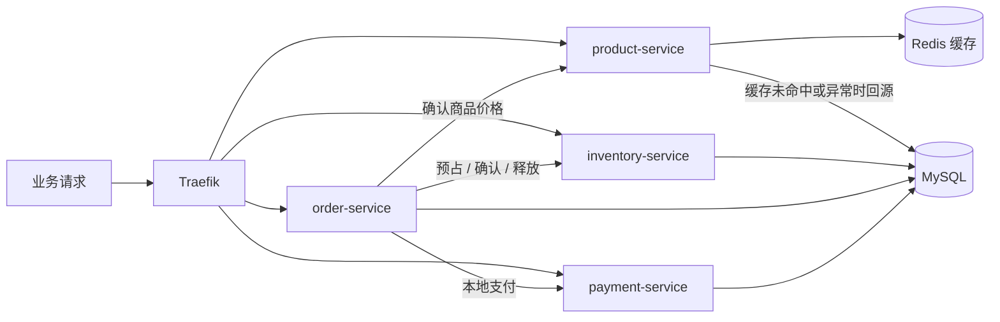

# Go OTel Demo · Commerce Incident Lab

**从一次业务异常出发，用真实调用链、日志和指标找到原因。**

这是一个可在本地运行的电商故障排障实验室：四个 Go 服务实现商品、库存、订单和支付流程，网页负责触发正常请求或随机故障，OpenTelemetry 串联观测数据，AI 会话中的 Skills 负责查询证据并形成诊断。适合学习 Go 自动埋点、跨服务故障传播和 AI 辅助排障。

[快速开始](#快速开始) · [完成一次排障](#完成一次排障) · [项目架构](#项目架构) · [观测与诊断](#观测与诊断) · [开发与验证](#开发与验证) · [常见问题](#常见问题)

## 可以体验什么

- **真实业务调用**：商品缓存与数据库回源、库存事务预占、订单编排、幂等支付及失败补偿。
- **不同故障现象**：请求失败、响应变慢，以及 HTTP 200 下的依赖异常与成功降级；下单异常也可能来自商品或库存服务。
- **真实调用链展示**：页面按本次 TraceId 读取 Jaeger spans，展示实际父子关系、耗时和错误，不补画未执行的下游。
- **有证据的 AI 排障**：从 TraceId 或业务症状开始，结合应用关系查询 Jaeger、Loki、Prometheus；分析后再人工揭晓故障对照。

网页无需配置模型 API key。AI 分析发生在支持本地 Skills 和脚本执行的会话中，查询脚本直接访问观测后端。

## 快速开始

准备好已启动的 Docker、支持 `docker compose up --wait` 的 Compose v2，以及 Git、Bash、OpenSSL。首次构建需要访问容器镜像仓库、GitHub 和 Go 模块代理；只运行容器不需要本机安装 Go。

```bash
git clone https://github.com/luozijian1990/go-otel-demo.git
cd go-otel-demo

bash scripts/init-demo-env.sh
docker compose config --quiet
docker compose up --build -d --wait
docker compose ps
```

初始化脚本会生成包含本地故障签名密钥的 `.env`，已有文件会原样保留。Compose 启动四个业务服务、MySQL、Redis 和观测组件；服务启动时自动创建各自的 `commerce_*` 表，并初始化商品 `SKU-001`。金额单位为分。

打开 **[业务故障实验室](http://localhost:18086/ui/)** 开始体验。

| 入口 | 地址 | 用途 |
| --- | --- | --- |
| 业务实验室 | [localhost:18086/ui/](http://localhost:18086/ui/) | 经 Traefik 访问网页 |
| Nginx 直接入口 | [localhost:18083](http://localhost:18083) | 同一网页，业务 API 仍经 Traefik |
| Jaeger | [localhost:16686](http://localhost:16686) | 查看 Trace 与 Span |
| Prometheus | [localhost:19090](http://localhost:19090) | 查询指标与抓取状态 |
| Loki 就绪检查 | [localhost:13100/ready](http://localhost:13100/ready) | 日志后端就绪状态；日志通过 API / Skill 查询 |
| Traefik Dashboard | [localhost:18082/dashboard/](http://localhost:18082/dashboard/) | 查看网关路由 |

> [!IMPORTANT]
> 这是本地教学环境，默认端口绑定 `127.0.0.1`，没有生产认证或租户隔离。请使用演示数据；服务会建表、写入订单并操作库存，不要连接生产数据库。

停止环境可执行 `docker compose down`。该命令保留命名卷，但 Jaeger 使用内存存储，容器停止后 Trace 会丢失；`down -v` 还会删除项目数据卷。

## 完成一次排障

1. 打开网页，选择商品、库存、订单或支付，点击“模拟异常”；也可以点击“随机模拟一次故障”。每类业务都提供“运行正常对照”。
2. 查看 HTTP 状态、耗时、业务 TraceId 和“本次调用链”。页面会等待 Jaeger 数据，最多自动重试 45 秒，也可手动重新查询。
3. 点击“复制排障上下文”，在项目目录中打开支持本地 Skills 的 AI 会话并粘贴。复制内容已包含 `$aiops-incident-rootcause` 指令、业务症状、时间窗口和关联 ID。
4. AI 读取应用关系 reference，按需使用三个观测 Skill，给出根因判断、传播路径、业务影响、证据与不确定性。
5. 保存诊断后，回到网页点击“揭晓本次故障”，核对实际注入回执。

默认每次只发出一条主业务调用。支付场景的建单准备、下单成功后的取消清理有独立 TraceId，不混入页面展示的主链路。最近现场仅保留订单进程内的 100 次记录，重启后不重放。

> [!NOTE]
> 故障答案不进入复制的排障上下文，诊断 Skill 也不读取故障目录或答案接口。需要独立练习时，使用未读过故障实现与历史答案的新会话；拥有源码背景的开发会话不属于严格黑盒盲测。单次请求适合定位链路和日志问题，不能据此宣称指标趋势或可靠的 P95。

## 项目架构

业务服务使用 Go / Gin、GORM / MySQL、go-redis；网页是 Nginx 托管的 HTML、CSS 和 JavaScript。下图展示正常业务依赖，实际执行路径以 Trace 为准。



| 服务 | 职责 | 进程入口 |
| --- | --- | --- |
| `product-service` | 商品资料和价格；Redis 缓存，MySQL 回源 | [service-c/cmd](service-c/cmd/) |
| `inventory-service` | 库存查询、事务预占、释放与确认 | [service-d/cmd](service-d/cmd/) |
| `order-service` | 确认价格、创建订单、编排库存与支付、失败补偿 | [service-a/cmd](service-a/cmd/) |
| `payment-service` | 按订单幂等记录本地支付，不连接真实支付渠道 | [service-b/cmd](service-b/cmd/) |

四个服务共享一个 MySQL 实例，但各自只读写自己拥有的表。库存用事务锁避免重复扣减或释放；支付明确失败时，订单服务释放库存；网络结果未知时保留库存并记录 `payment_unknown`，允许幂等重试；需要对账时记录 `reconciliation_required`。订单编排有单实例串行保护，属于教学实现，不提供生产级分布式事务保证。

演示控制模块嵌入订单进程，通过 `POST /demo/runs` 创建现场，再经真实 Traefik 发起业务请求。每条请求独立起 Trace，driver span 标记 `demo.traffic_driver=true`，不能把它当成订单服务故障根因。控制面同一时间只允许一个活动演示，使用短期签名控制，不修改全局数据库连接或执行清库操作。

<details>
<summary>主要业务 API</summary>

以下接口均可通过 `http://localhost:18086` 访问，完整实现见 [commerce/routes.go](commerce/routes.go)。

| 方法与路径 | 用途 / JSON 字段 |
| --- | --- |
| `GET /products/SKU-001` | 商品资料与价格 |
| `GET /inventory/SKU-001` | 可售库存 |
| `POST /orders` | 创建订单：`id`、`sku`、`quantity` |
| `GET /orders/:id` | 查询订单状态 |
| `POST /orders/:id/pay` | 本地支付并确认库存 |
| `POST /orders/:id/cancel` | 取消待支付订单并释放库存 |
| `POST /reservations` | 库存预占：`order_id`、`sku`、`quantity` |
| `POST /reservations/:id/release` | 释放预占 |
| `POST /reservations/:id/confirm` | 确认预占 |
| `POST /payments` | 本地支付记录：`order_id`、`amount_cents` |

可以先发一个只读请求：

```bash
curl -i http://localhost:18086/products/SKU-001
```

响应头包含业务 `X-Trace-Id` 和 `X-Request-Id`；正常 Trace 受采样影响，不一定能在 Jaeger 查到。

</details>

## 观测与诊断

### 三类信号如何产生

| 信号 | 采集路径 | 主要用途 |
| --- | --- | --- |
| Traces | Traefik / Go 自动埋点 → OTLP → Collector 尾部采样 → Jaeger | 调用关系、慢分支、错误传播 |
| Logs | 应用 slog JSON 文件 / 网关业务访问日志 → Collector filelog → Loki 原生 OTLP | 原始错误、业务状态、缓存回源与补偿 |
| Metrics | 各服务 `/metrics` → Prometheus 每 5 秒抓取 | 请求量、错误率、延迟、依赖失败、fallback 与 inflight |

四服务在根 [Dockerfile](Dockerfile) 中用 LoongSuite Go Agent `v1.10.0` 执行 `otel go build`，由 Compose 的 `OTEL_*` 配置启动 tracing SDK。业务代码复用该 Provider，通过 `http.NewRequestWithContext` 和 W3C Trace Context 传播上下文，并用 `RecordError` / `SetStatus` 标记业务服务端错误，没有另建一套 tracing SDK。普通 `go build` 或单元测试通过，不等于自动埋点已验证。

[Collector 配置](otel/collector.yaml) 等待约 10 秒做尾部采样：保留 HTTP 5xx、ERROR span 和达到 3 秒阈值的 Trace，普通成功 Trace 约保留 1%，再批量导出。请求的 sampled 标记不能证明数据已经进入 Jaeger。

日志保留 `trace_id`、`request_id`、`experiment_id`、`order_id` 等关联信息，Loki 仅以 `service_name` 作索引。Prometheus 不使用请求 ID 或订单 ID 作为标签；指标按服务与时间窗口关联，不能按 TraceId 精确连接。应用等待与实际 SQL / Redis 操作分别计时。

### 四个诊断 Skill

| Skill | 工作内容 |
| --- | --- |
| [aiops-incident-rootcause](.agents/skills/aiops-incident-rootcause/SKILL.md) | 综合入口：读取应用关系、选择查询、交叉验证并形成诊断 |
| [jaeger-trace-rootcause](.agents/skills/jaeger-trace-rootcause/SKILL.md) | 按 TraceId 或服务 / 时间查询调用链，分析错误传播与耗时 |
| [loki-incident-logs](.agents/skills/loki-incident-logs/SKILL.md) | 按关联 ID 或服务 / 时间查询错误、状态变化与补偿日志 |
| [prometheus-incident-metrics](.agents/skills/prometheus-incident-metrics/SKILL.md) | 查询请求、错误、延迟、依赖失败与降级指标 |

[application-map.md](.agents/skills/aiops-incident-rootcause/references/application-map.md) 模拟 CMDB，描述服务职责、正常依赖、存储和状态语义。它是诊断背景，不代表实时健康，也不包含故障答案。Skills 只读观测数据，不自动修复或评分。

查询脚本只依赖 Python 3 标准库。在仓库根目录运行，将 `TRACE_ID` 替换为现场值：

```bash
python3 .agents/skills/jaeger-trace-rootcause/scripts/query.py --trace-id TRACE_ID --wait 20
python3 .agents/skills/loki-incident-logs/scripts/query.py --trace-id TRACE_ID --lookback 300
python3 .agents/skills/prometheus-incident-metrics/scripts/query.py --service order-service --lookback 300
```

默认回看 5 分钟，可用 `--start` / `--end` 指定现场的 UTC 时间，单次窗口最多 1 小时。查询返回来源、窗口、证据 ID、状态与限制，并脱敏控制字段。无 TraceId 时可用 Jaeger 的 `--service` 查询；Loki 还支持 `--request-id` 和 `--run-id`。这些 Skill 脚本依赖仓库内的 `scripts/observability/`，不要只复制单个 `SKILL.md`。

## 开发与验证

### 源码导航

```text
commerce/                  当前业务逻辑、事务、故障控制、Trace 展示与遥测
service-{a,b,c,d}/cmd/      四个服务的薄进程入口，各自为独立 Go module
web/                       实验室页面与 Nginx 配置
.agents/skills/            综合诊断与三个观测 Skill、应用关系 reference
scripts/observability/     共享查询与 Trace 清洗实现
scripts/smoke-commerce.py  真实业务冒烟验证
Dockerfile                 统一自动埋点构建，使用仓库根目录作为上下文
docker-compose.yml         当前运行拓扑与环境配置
otel/                      Collector 配置
observability/             Loki / Prometheus 配置
traefik/                   网关与路由配置
docs/observations/         已保存的验证记录与诊断示例
```

四个入口模块通过 `replace` 引用共享 `commerce/`。启动配置来自环境变量；旧 `service-*/config.yaml` 不会被当前入口读取。需要切换到其他演示依赖时，在私有 `.env` 中设置 `BUSINESS_MYSQL_DSN`、`BUSINESS_REDIS_ADDR`、`BUSINESS_REDIS_PASSWORD`，格式见 [.env.example](.env.example)。

### 本地检查

Go 测试需要 Go 1.25 或更高版本；Python 检查不需要安装额外包。以下命令在仓库根目录执行：

```bash
(cd commerce && go test -race ./...)
for service in service-a service-b service-c service-d; do
  (cd "$service" && go test ./...) || exit 1
done
python3 -m unittest discover -s scripts -p '*_test.py'
docker compose config --quiet
```

环境启动后，可运行真实业务冒烟：

```bash
python3 scripts/smoke-commerce.py --controls
```

该脚本会创建演示订单、支付并消耗演示库存，验证幂等、支付失败补偿、四类随机故障、独立 TraceId 和两个网页入口的 API 代理。`--controls` 从 `.env` 读取签名密钥以验证故障，不调用模型，也不能代替 AI 诊断质量验证。

已有证据可从以下记录继续阅读：

- [业务版本验证记录](docs/observations/business-demo-validation.md)：构建、业务冒烟、观测查询与环境差异。
- [单次调用链与独立诊断验证](docs/observations/single-call-subagent-validation.md)：同一次故障分别从 TraceId 和业务症状开始调查，不是准确率 benchmark。
- [综合诊断示例](docs/observations/business-incident-example.md)：根因、传播、影响与证据限制。

这些记录使用过本地缓存依赖版本；默认 Compose 镜像组合的全新环境和 amd64 运行尚未在记录中验证。

## 常见问题

| 现象 | 说明与检查方式 |
| --- | --- |
| Compose 提示缺少 `DEMO_FAULT_SECRET` | 先运行初始化脚本。若 `.env` 已存在，脚本不会补写；确认其中有有效密钥，可用 `openssl rand -hex 32` 生成后手动填入，勿提交该文件。 |
| 构建下载失败或服务未就绪 | 用 `docker compose ps` 和 `docker compose logs --tail=100 <服务名>` 检查；区分镜像 / Agent / Go 模块下载失败与数据库初始化失败。 |
| 有 TraceId，但 Jaeger 查不到 | 等待尾部采样与导出，检查 `otel-collector` 日志；正常请求可能未被保留，页面 45 秒后可重新查询。 |
| 模拟异常仍返回 HTTP 200 | 可能是缓存异常后成功回源；结合 Redis span、fallback 日志与指标判断。 |
| 日志查询为空或被截断 | 核对 UTC 窗口；历史现场可能已超出默认 5 分钟。缩小范围或按 TraceId 精确查询，空结果不代表没有故障。 |
| 指标无数据或 P95 不稳定 | 检查 Prometheus Targets、抓取样本和窗口；单次点击不足以判断趋势，无样本也不等于零错误。 |
| 重启后记录消失 | 网页历史在进程内，Jaeger Trace 在内存中。MySQL、Loki、Prometheus 使用卷；Loki 保留 7 天，Prometheus 保留 7 天并限制 512 MiB。 |

历史版本的独立 AIOps 平台、旧服务实现、接口演示脚本和开发计划已从当前源码移除，可通过 Git 历史查阅。当前运行入口以根 `docker-compose.yml` 和 `Dockerfile` 为准。

[OTel 概念课](docs/presentations/otel-concept-slides.html) 保留作为概念教学材料，其中的服务名、接口和 Trace 截图来自历史版本，不作为当前启动或 API 操作指南。
